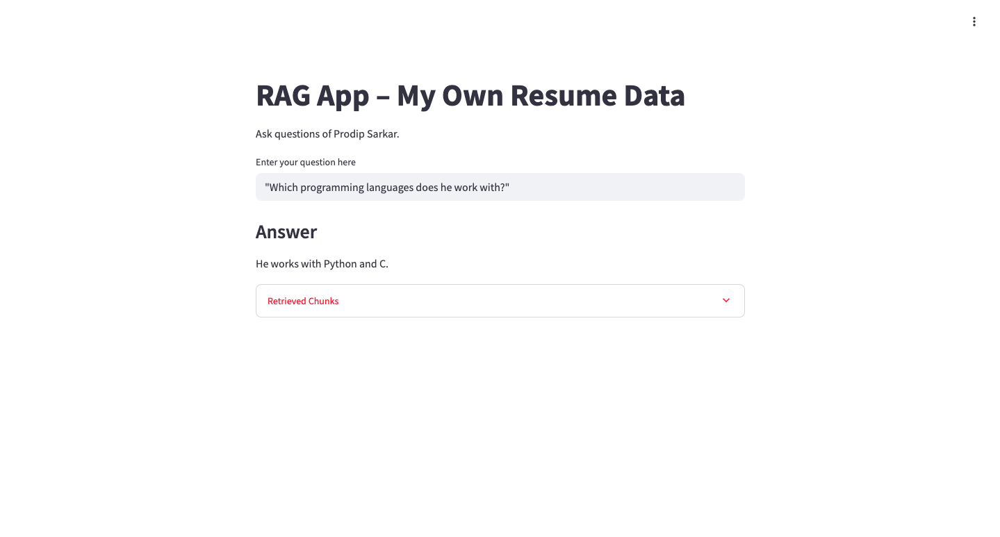

# RAG-APPLICATION

1. Create Environment

`conda create -n env python==3.10 -y`

2. Activate Environment

`conda activate env`

3. Install Requirements

`pip install -r requirements.txt`

# Project Structure

# Results 

# live 
 Demo - https://simple-myresume-chatbot.onrender.com/
 